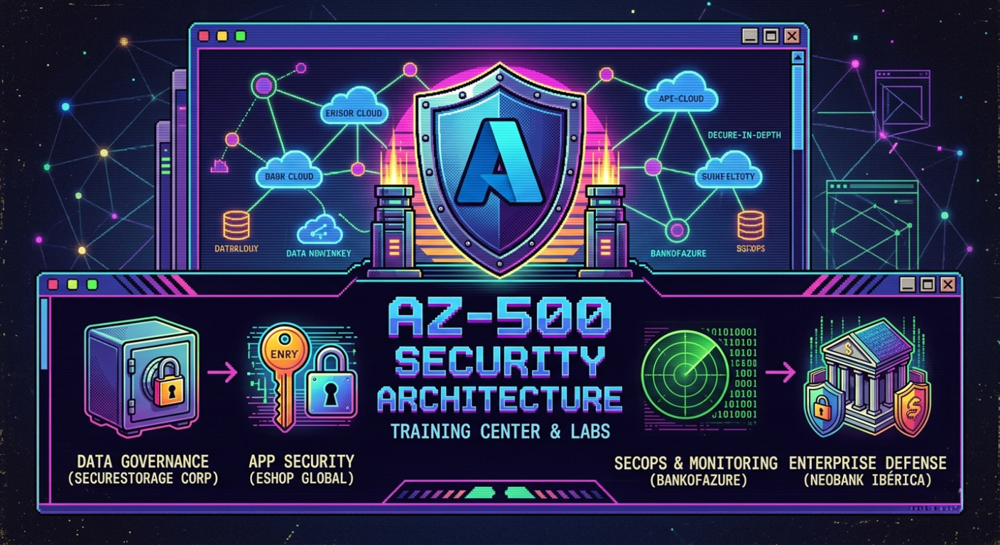
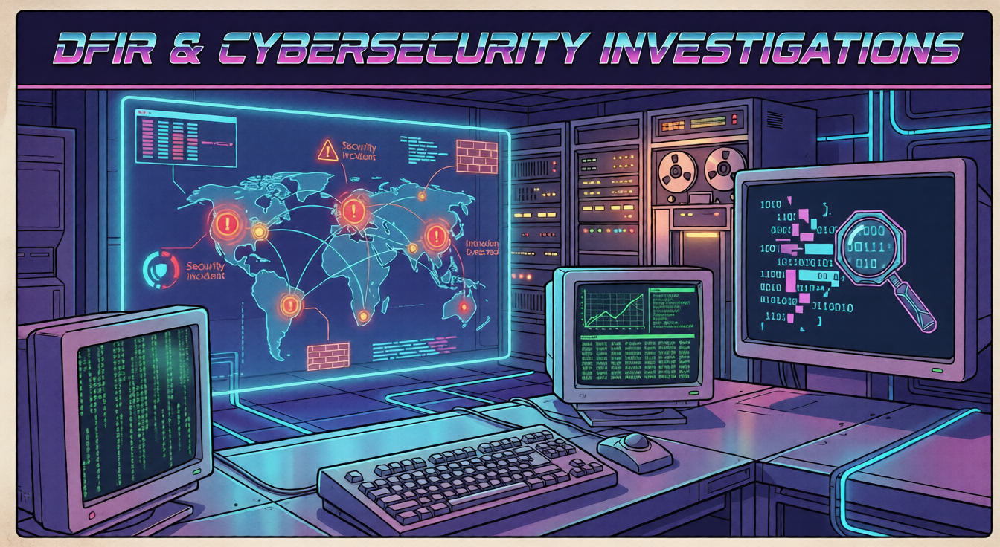
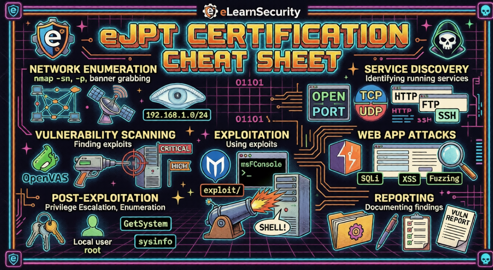

# 👨‍💻 Hi, I'm Kenner Letelier

### 🛡️ Cybersecurity Specialist | Purple Teamer 

I hold a Higher Degree in Network Systems Administration with a specialization in Cybersecurity (ASIXCIBER). My methodology combines offensive tactics with defensive architecture, focusing on Cloud Security, Incident Response, and Vulnerability Assessment. I build resilient infrastructures, and I break them to make them stronger.

---

### 🏆 Certifications

**Active**
* 🔵 **Microsoft Certified:** Azure Security Engineer Associate (AZ-500)
* 🔵 **CompTIA:** Cybersecurity Analyst (CySA+)
* 🔴 **eLearnSecurity:** Junior Penetration Tester (eJPTv2)
* 🟡 **ISC2:** Certified in Cybersecurity (CC)

**In Progress**
* 🔴 **eLearnSecurity:** Web Application Penetration Tester eXtreme (eWPTX)
* 🔴 **Offensive Security:** OSCP+
* 🔴 **Zero-Point Security:** Certified Red Team Operator (CRTO)

---

### 🎯 Lead Project: Applied Security Engineering

#### 🎣 [Phishing Simulation SaaS (TFG)](https://github.com/kenner-letelier/Security-Awareness-tfg)
> **Stack:** React, Vite, Supabase (PostgreSQL), OpenAI API, SecOps.

Full-stack development of a *Phishing as a Service* (PhaaS) platform engineered for human risk management and security awareness.

* **AI-Driven Threat Simulation:** Integrated the OpenAI API to programmatically generate highly contextual phishing pretexts, bypassing static detection patterns.
* **Secure Sandbox Architecture:** Engineered a constrained backend environment utilizing PostgreSQL `SECURITY DEFINER` functions, Row Level Security (RLS), and SQL Triggers to enforce strict execution limits and prevent outbound abuse.
* **Risk Telemetry & Reporting:** Built an analytics engine to track compromise rates in real-time, automatically generating executive PDF reports that map incidents to actionable mitigation strategies.
* 🌍 **Live Demo:** [securityawareness.tech](https://securityawareness.tech/)

---

### 🧠 Security Engineering & Operations (Knowledge Base)

To maintain a streamlined repository, my extensive architectural deployments, DFIR investigations, and offensive playbooks are documented in my Notion Knowledge Base.

**☁️ [Cloud Security & Zero Trust Architecture (AZ-500 Labs)](https://upbeat-fender-c91.notion.site/Azure-Security-AZ-500-Practical-Lab-Series-35ed652d88ed834d8d5581adc70b78f9)**
* **Enterprise Topologies:** Design and deployment of simulated corporate network environments (BankOfAzure, NeoBank Ibérica) utilizing Hub-and-Spoke architectures.
* **Microsegmentation:** Implementation of Azure Firewall Premium, Network Security Groups (NSGs), and Application Gateway (WAF) to isolate critical application tiers.
* **Identity-First Security:** Configuration of RBAC, Conditional Access via Entra ID, and data protection using Azure Key Vault and Private Links.

**🔍 [Threat Hunting & DFIR](https://upbeat-fender-c91.notion.site/DFIR-Cybersecurity-Investigations-344d652d88ed80519a36dc2cfb9e0b34)**
* **Malware & APT Analysis:** Reverse-engineering attack vectors of Conti Ransomware and tracking persistence mechanisms of simulated Advanced Persistent Threats (Boogeyman 2 & 3).
* **Detection Engineering:** Live network traffic analysis deploying Snort IDS/IPS to identify exploitation attempts and malicious signatures.
* **Forensics:** Investigation of fileless PowerShell executions (PS_Eclipse) and post-incident database exfiltration analysis (Sequel Dump).

**⚔️ [Offensive Security: eJPT Cheat Sheet](https://upbeat-fender-c91.notion.site/eJPT-Cheat-Sheet-33cd652d88ed80999756d9368d34732c)**
* **Methodology:** Structured attack lifecycles based on eJPT and PTES standards.
* **Tactics:** Exploitation of legacy protocols (SMB, FTP), web application vulnerability assessments, network pivoting, and local privilege escalation vectors across Windows and Linux environments.

---

### 🎮 Software Engineering Foundation (C# / Unity)

My background in Video Game Development provides a deep understanding of Object-Oriented Programming (OOP), system architecture, and logic optimization—skills that directly enhance my scripting and reverse-engineering capabilities.

| Proyecto | Enfoque Técnico | Tecnologías |
| :--- | :--- | :--- |
| **[Advanced TPS Controller](https://github.com/kenner-letelier/GuyHard_Unity_Proyecto_ll_3D)** | Sistemas de inventario circular, mecánicas de cobertura táctica y físicas avanzadas (*Raycasting*). | `Unity 3D` `C#` `Animation Rigging` |

| **[AI Sandbox](https://github.com/kenner-letelier/ThirdPersonController_En_Entornos3D)** | Máquinas de estados (FSM) y *NavMeshAgent* para comportamientos complejos de persecución y reacción. | `Unity 3D` `C#` `AI Navigation` |

| **[Space Shooter 2.5D](https://github.com/kenner-letelier/Amenaza_Unity_Mobile_2.5D)** | Optimización extrema para móviles mediante *Object Pooling Pattern* y gestión de oleadas. | `Unity` `C#` `Mobile Optimization` |
| **[Metroidvania 2D](https://github.com/kenner-letelier/Metroidvania_Unity_Proyectos-III-main)** | Lógica core de plataformas 2D, raycasting personalizado y diseño de niveles. | `Unity 2D` `C#` `FSM` |

| **[Post-Apocalyptic Env.](https://github.com/kenner-letelier/Escenario3D_Postguerra)** | *Technical Art*, *Level Design*, Iluminación global (*Baked GI*) y *Post-Processing Stack*. | `Unity 3D` `Lighting` `Rendering` |

---

### 🛠️ Tech Stack & Herramientas

