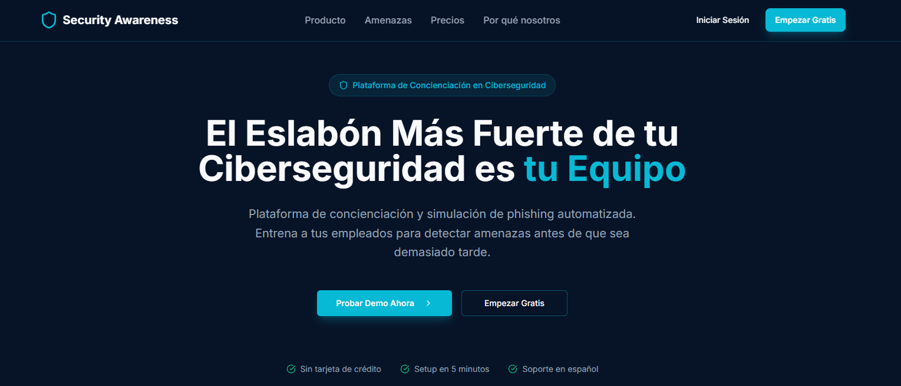
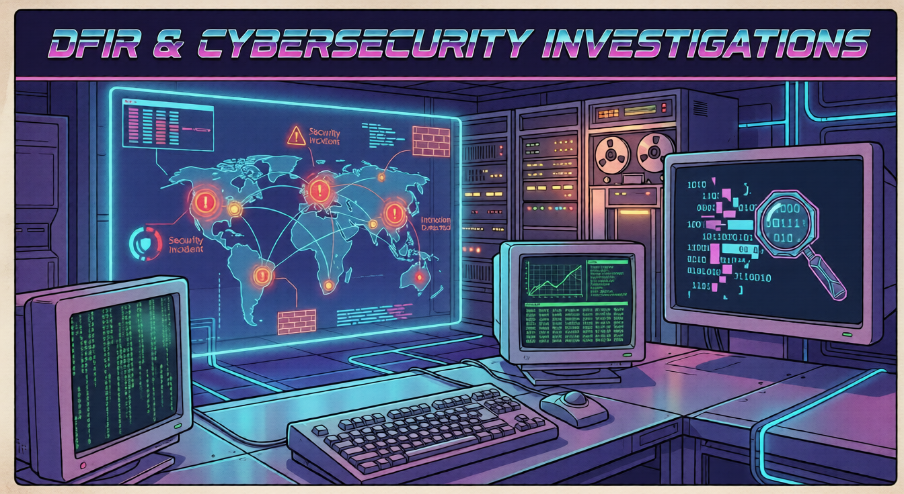

# 👨‍💻 Hi, I'm Kenner Letelier

### 🛡️ Cybersecurity Specialist | Purple Teamer 

I hold a Higher Degree in Network Systems Administration with a specialization in Cybersecurity (ASIXCIBER). My methodology combines offensive tactics with defensive architecture, focusing on Cloud Security, Incident Response, and Vulnerability Assessment. I build resilient infrastructures, and I break them to make them stronger.

---

### 🏆 Certifications

**Active**
* 🔵 **Microsoft Certified:** Azure Security Engineer Associate (AZ-500)
* 🔵 **CompTIA:** Cybersecurity Analyst (CySA+)
* 🔴 **eLearnSecurity:** Junior Penetration Tester (eJPTv2)
* 🟡 **ISC2:** Certified in Cybersecurity (CC)

**In Progress**
* 🔴 **eLearnSecurity:** Web Application Penetration Tester eXtreme (eWPTX)
* 🔴 **Offensive Security:** OSCP+
* 🔴 **Zero-Point Security:** Certified Red Team Operator (CRTO)

---

### 🎯 Lead Project: Applied Security Engineering

#### 🎣 [Phishing Simulation SaaS (TFG)](https://github.com/kenner-letelier/Security-Awareness-tfg)
> **Stack:** React, Vite, Supabase (PostgreSQL), OpenAI API, SecOps.

Full-stack development of a *Phishing as a Service* (PhaaS) platform engineered for human risk management and security awareness.

* **AI-Driven Threat Simulation:** Integrated the OpenAI API to programmatically generate highly contextual phishing pretexts, bypassing static detection patterns.
* **Secure Sandbox Architecture:** Engineered a constrained backend environment utilizing PostgreSQL `SECURITY DEFINER` functions, Row Level Security (RLS), and SQL Triggers to enforce strict execution limits and prevent outbound abuse.
* **Risk Telemetry & Reporting:** Built an analytics engine to track compromise rates in real-time, automatically generating executive PDF reports that map incidents to actionable mitigation strategies.
* 🌍 **Live Demo:** [securityawareness.tech](https://securityawareness.tech/)

---
### 🧠 Security Engineering & Operations (Portfolio)

To provide a comprehensive, visual, and interactive view of my technical research, I maintain a centralized **[Cybersecurity Portfolio in Notion](https://upbeat-fender-c91.notion.site/Kenner-Letelier-Cloud-Security-SecOps-Engineer-f5ad652d88ed821e952d01bf5daf1692?source=copy_link)**. 

Instead of hosting raw PDFs, this knowledge base details the architecture, context, and execution of my deployments and investigations, structured into four core pillars:

* **🛡️ Cloud Security & Zero Trust:** Enterprise topology designs (Hub-and-Spoke), Identity-First security (Entra ID, PIM, Conditional Access), and governance via Azure Policy (AZ-500 Labs).
* **🔵 Blue Team (SecOps & DFIR):** Malware triage, ransomware memory forensics, Threat Hunting (KQL/Splunk), and SOC automation with Microsoft Sentinel.
* **🏗️ Cloud Infrastructure & Data:** Deployment of Cloud Core architectures (AKS, Kubernetes, VMs) and Data Engineering pipelines (Data Lake, Databricks, Event Hubs).
* **🔴 Red Team (Offensive Security):** Structured attack lifecycles, web application vulnerabilities, and privilege escalation methodologies.

👉 **[Explore my full technical portfolio here](https://upbeat-fender-c91.notion.site/Kenner-Letelier-Cloud-Security-SecOps-Engineer-f5ad652d88ed821e952d01bf5daf1692?source=copy_link)**

---

### 🎮 Software Engineering Foundation (C# / Unity)

My background in Video Game Development provides a deep understanding of Object-Oriented Programming (OOP), system architecture, and logic optimization—skills that directly enhance my scripting and reverse-engineering capabilities.

| Project | Technical Focus | Technologies |
| :--- | :--- | :--- |
| **[Advanced TPS Controller](https://github.com/kenner-letelier/GuyHard_Unity_Proyecto_ll_3D)** | Circular inventory systems, tactical cover mechanics, and custom physical raycasting. | `Unity 3D` `C#` `Animation Rigging` |

| **[AI Sandbox](https://github.com/kenner-letelier/ThirdPersonController_En_Entornos3D)** | Finite State Machines (FSM) and *NavMeshAgent* for autonomous pathfinding and behavior. | `Unity 3D` `C#` `AI Navigation` |

| **[Space Shooter 2.5D](https://github.com/kenner-letelier/Amenaza_Unity_Mobile_2.5D)** | Engine optimization for mobile devices utilizing the *Object Pooling Pattern*. | `Unity` `C#` `Mobile Optimization` |
| **[Metroidvania 2D](https://github.com/kenner-letelier/Metroidvania_Unity_Proyectos-III-main)** | Core 2D platformer physics, state management, and level design. | `Unity 2D` `C#` `FSM` |

| **[Post-Apocalyptic Env.](https://github.com/kenner-letelier/Escenario3D_Postguerra)** | Rendering pipelines, *Baked GI* global illumination, and *Post-Processing Stacks*. | `Unity 3D` `Lighting` `Rendering` |

---

### 🛠️ Core Tech Stack & Tools

| Area | Technologies |
| :--- | :--- |
| **OS & Offensive** |      |
| **Cloud & SecOps** |      |
| **Threat Analysis** |        |
| **Software Dev** |     |
